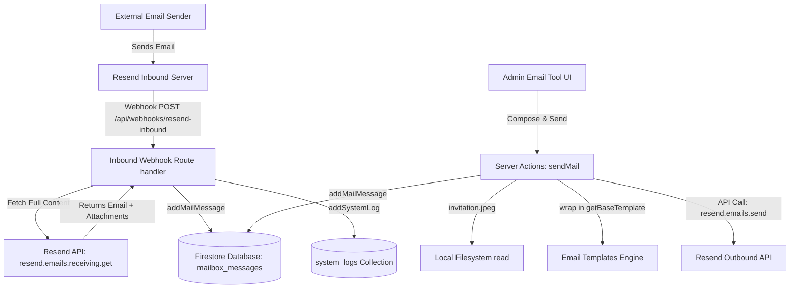

# Mailbox and Emailing Architecture (Resend & Firestore Integration)

This document provides a technical overview of the email and inbox capabilities implemented in the **Beauty of Cloud 2.0 (BOC 2.0)** project, specifically focusing on the **Resend Inbound** webhook integration, Firestore data models, outbound emailing workflows, and specialized voucher distribution systems.

---

## 1. Overall System Architecture

The email system handles both **incoming (inbound)** emails sent to the domain and **outgoing (outbound)** transactional/manual administrator messages. In BOC 2.0, the backend database layer is built entirely on **Firebase Firestore**.



---

## 2. Inbound Email Flow (`/api/webhooks/resend-inbound`)

Resend notifies the application of incoming emails using webhook events. Here is the step-by-step ingestion process:

1. **Webhook Ingestion**: Resend sends a `POST` request to `/api/webhooks/resend-inbound`.
2. **Payload Verification**:
   - The route handler validates that the incoming payload `type` matches `"email.received"`.
   - The payload itself contains only minimal metadata (specifically `webhookData.email_id`).
3. **Full Content Retrieval**:
   - Webhooks do not contain the email body or attachments for size/security reasons.
   - The application initializes the Resend SDK with `process.env.RESEND_API_KEY` and calls:
     ```typescript
     const { data: emailContent, error: fetchError } = await resend.emails.receiving.get(
       webhookData.email_id
     );
     ```
4. **Database Archival (Firestore)**:
   - Once fetched, the email is written to the Firestore collection `"mailbox_messages"` via `addMailMessage`:
     - `resend_id` $\leftarrow$ Resend's email identifier.
     - `direction` $\leftarrow$ `'incoming'`
     - `from_email` / `to_email` $\leftarrow$ Extracted email headers.
     - `content_text` / `content_html` $\leftarrow$ Plaintext and HTML message body.
     - `folder` $\leftarrow$ `'inbox'`
     - `is_read` $\leftarrow$ `false`
     - `metadata` $\leftarrow$ Stores the raw JSON headers, webhook event type, and **attachments** array.
     - `createdAt` $\leftarrow$ Firebase `serverTimestamp()`.
5. **System Log Creation**:
   - An audit log is inserted into the `"system_logs"` collection using `addSystemLog` with `log_type: "resend_inbound"`.

---

## 3. Database Models (Firestore)

The mailbox feature utilizes two primary Firestore collections:

### A. Collection: `"mailbox_messages"`
Represented by the typescript interface `MailMessage` in [api.ts](file:///home/senu/PROJECTS/boc-2.0/src/firebase/api.ts):

```typescript
export interface MailMessage {
  id: string;
  resend_id: string;
  direction: 'incoming' | 'outgoing';
  from_email: string;
  to_email: string;
  subject: string;
  content_text: string;
  content_html: string;
  folder: MailFolder; // 'inbox' | 'sent' | 'archive' | 'trash'
  is_read: boolean;
  metadata?: {
    headers?: any;
    attachments?: any;
    webhook_type?: string;
    source?: string;
    cc?: string | null;
    bcc?: string | null;
  };
  createdAt: any; // serverTimestamp()
}
```

### B. Collection: `"system_logs"`
Used for system log auditing of incoming emails.

---

## 4. Attachment Management

### A. Inbound Attachments
- **Storage**: Attachments are retrieved from Resend via the `resend.emails.receiving.get()` call.
- **Recording**: The attachments array is stored in the `metadata` map of the message document under the `attachments` key.
- **Display**: The email page displays the content but doesn't currently build links from `metadata.attachments` for user download.

### B. Outbound Attachments (Speaker Invitation)
- **Local Read**: The `sendMail` server action supports a special `attachInvitation` boolean option. If enabled, it reads a local static image file from:
  `public/invitation.jpeg`
- **Buffer Ingest**: The file is read synchronously using `fs.readFileSync` and mapped to a Resend attachment structure:
  ```typescript
  {
    filename: 'invitation.jpeg',
    content: invitationBuffer
  }
  ```
- **Resend Outbound**: Forwarded directly within the `attachments` array in the `resend.emails.send()` payload.

---

## 5. Outbound Transactional and Admin Emails

Outbound emailing uses the Server Action `sendMail` defined in [mailbox.ts](file:///home/senu/PROJECTS/boc-2.0/src/app/actions/mailbox.ts):

- **Sender Address**: Sent from `Beauty of Cloud 2.0 <noreply@beautyofcloud.com>`.
- **Branding**: Wraps outgoing text content in the default responsive layout template `getBaseTemplate(content)` (located in `src/lib/email/templates.ts`).
- **Options**: Supports custom `to`, `cc`, `bcc` fields as well as attachment toggling.
- **Logging**: Writes the sent email into `"mailbox_messages"` under `folder: 'sent'`, `direction: 'outgoing'`, and `is_read: true`.
- **Revalidation**: Calls `revalidatePath('/admin/email-tool')` to keep admin folder lists in sync.

---

## 6. AWS Voucher Distribution (Special Operation)

The email dashboard implements a custom AWS credit voucher distribution utility for top-performing students:

1. **Leaderboard Analysis**:
   - The user selects a quiz.
   - The page retrieves submissions using `getQuizSubmissions(selectedQuizId)`.
   - It performs in-memory deduplication (only considering each student's highest score/fastest completion time) and extracts the top 30 performers.
2. **Voucher Assignment**:
   - Assigns a voucher code to each of the 30 performers from a static pool (`VOUCHER_CODES` array).
3. **Controlled Batch Distribution**:
   - Admin can review mapped students, test the email protocol, and execute sending in batches of 5.
   - Generates the email templates (`getAWSTemplate` or `getInquiryTemplate`) and dispatches them via Resend with configurable administrator BCCs.

---

## Code References
- **Inbound Webhook**: [route.ts](file:///home/senu/PROJECTS/boc-2.0/src/app/api/webhooks/resend-inbound/route.ts)
- **Server Actions**: [mailbox.ts](file:///home/senu/PROJECTS/boc-2.0/src/app/actions/mailbox.ts)
- **Firestore APIs**: [api.ts](file:///home/senu/PROJECTS/boc-2.0/src/firebase/api.ts)
- **Admin UI Page**: [page.tsx](file:///home/senu/PROJECTS/boc-2.0/src/app/admin/email-tool/page.tsx)
